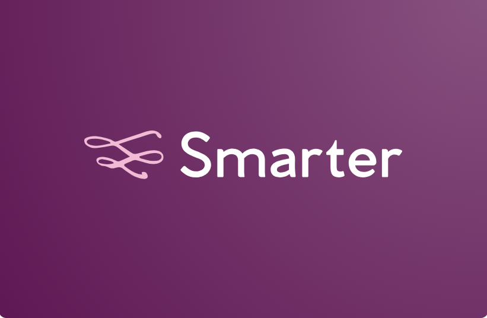

<h2 align="center">
 <br>
 
 <br>
 <br>
 Smarter: Lightning Fast AI Chatbot that Responds With Live Interactive Crypto&Stock Charts, Financials, News, Screeners, and More 
 <br>
</h2>

<p align="center">
 <a href="#Overview">Overview</a> •
 <a href="#Features">Features</a> •
 <a href="#Quickstart">Quickstart</a> •
</p>

<br>

[Demo of ChatBot]([Smarter: An AI Web3 Chatbot](https://stockbot-powered-by-groq-n8ecs6hwq-bofu2007s-projects.vercel.app/)
> Demo of ChatBot providing relevant, live, and interactive stock charts and interfaces


## Overview

Smarter is an AI-powered chatbot that leverages Llama3 70b on Groq, Vercel’s AI SDK, and TradingView’s live widgets to respond in conversation with live, interactive charts and interfaces specifically tailored to your requests. Groq's speed makes tool calling and providing a response near instantaneous, allowing for a sequence of two API calls with separate specialized prompts to return a response.

> [!IMPORTANT]
>  Note: Chatbot may provide inaccurate information and does not provide investment advice. It is for entertainment and instructional use only.

## Features

- 🤖 **Real-time AI Chatbot**: Engage with AI powered by Llama3 70b to request crpto and stock news, information, and charts through natural language conversation
- 📊 **Interactive Crypto&Stock Charts**: Receive near-instant, context-aware responses with interactive TradingView charts that host live data
- 🔄 **Adaptive Interface**: Dynamically render TradingView UI components for financial interfaces tailored to your specific query
- 🌐 **Multi-Asset Market Coverage**: Access comprehensive data and analysis across stocks, forex, bonds, and cryptocurrencies


## Quickstart

> [!IMPORTANT]
> To use ChatBot, you can use a hosted version at [Smarter]([Smarter: An AI Web3 Investment Chatbot](https://stockbot-powered-by-groq-n8ecs6hwq-bofu2007s-projects.vercel.app/).
> Alternatively, you can run StockBot locally using the quickstart instructions.


To run it locally
```bash
cp .env.example .env.local
```

Add your Groq API key to .env.local, then run:

```bash
pnpm install
pnpm dev
```

Your app should now be running on [localhost:3000](http://localhost:3000/).


